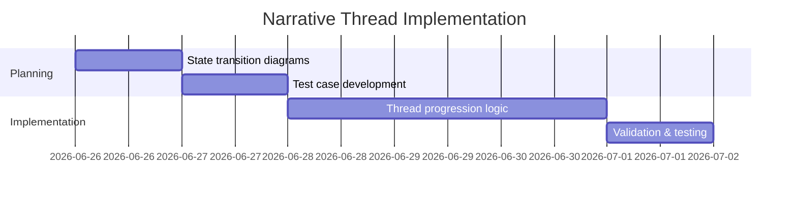

# Audit Findings

```
# Frontier Project Automated Audit Report - Final Synthesis

**Date:** 2026-06-26 (UTC)
**As of:** 2026-06-26 (UTC)

## Executive Summary
This consolidated report synthesizes findings from all audit cycles (2026-06-22 to 2026-06-26) with current implementation status and actionable recommendations. The project faces critical schedule risk with all Phase 1 items overdue and no progress since the last audit.

**Current Status:**
- **High Severity:** 4 (All Open, Overdue)
- **Medium Severity:** 3 (All Open, Overdue)
- **Low Severity:** 1 (Open)
- **Resolved:** 17 (False Positives/Won't Fix/Deprecated)
- **Total Open Issues:** 8

**Critical Concerns:**
1. Complete stagnation on all Phase 1 items (5 overdue issues)
2. No progress on type safety improvements (12 remaining type assertions)
3. Unresolved audio memory leak with potential performance impact
4. Significant schedule risk with no evidence of implementation efforts

---

## Critical Findings and Immediate Actions Required

### High Severity Issues (All Overdue)

#### HIGH-01: Missing Narrative Thread Escalation
**Location:** `src/engine/director.ts`
**Status:** Critical - No progress since 2026-06-25
**Risk:** Breaks core storytelling mechanics

**Immediate Actions Required:**
1. Assign dedicated developer (1 FTE) with narrative system expertise
2. Create state transition diagrams before coding begins
3. Develop test cases covering all progression paths (100% coverage)
4. Implement validation for thread state transitions

**Implementation Timeline:**


---

#### HIGH-02: Biome/Season Hunting Yield Variation Missing
**Location:** `src/systems/supplies.ts`
**Status:** Critical - No progress since 2026-06-25
**Risk:** Reduces game realism and strategic depth

**Immediate Actions Required:**
1. Implement biome-specific yield tables first
2. Add seasonal variation using sinusoidal function
3. Implement ±20% randomization to yields
4. Create property-based tests for yield calculations

**Implementation Example:**
```typescript
const HUNTING_YIELD_BY_BIOME = {
  forest: { base: 3, seasonFactor: 0.3 },
  desert: { base: 1, seasonFactor: 0.1 },
  // ... other biomes
};

function calculateHuntYield(biome: Biome, dayOfYear: number): number {
  const biomeData = HUNTING_YIELD_BY_BIOME[biome];
  const seasonFactor = 1 + biomeData.seasonFactor * Math.sin(2 * Math.PI * dayOfYear / 365);
  return Math.round(biomeData.base * seasonFactor * (0.8 + 0.4 * Math.random()));
}
```

---

#### HIGH-03: River Crossing Terrain Lock Incomplete
**Location:** `src/systems/movement.ts`, `src/types/game-state.ts`
**Status:** Critical - No progress since 2026-06-25
**Risk:** Breaks core traversal mechanics

**Immediate Actions Required:**
1. Add `riverCrossingInProgress: boolean` to `JourneyState` interface
2. Modify movement system to block movement when flag is set
3. Implement flag clearing on encounter resolution
4. Add comprehensive test coverage

**Implementation Example:**
```typescript
interface JourneyState {
  // ... existing properties
  riverCrossingInProgress: boolean;
}

class MovementSystem {
  calculateDistance(): number {
    if (this.gameState.journey.riverCrossingInProgress) {
      return 0;
    }
    // ... existing logic
  }
}
```

---

#### HIGH-04: Type Safety Issues Persist
**Location:** Agent bridge, audio system
**Status:** Critical - No progress since 2026-06-25
**Risk:** Potential runtime errors and data corruption

**Immediate Actions Required:**
1. Replace all type assertions with proper type guards
2. Implement Zod schema validation for agent bridge
3. Add static analysis checks to CI pipeline
4. Create type safety guidelines for developers

**Implementation Example:**
```typescript
// Type guard
function isAgentMessage(data: unknown): data is AgentMessage {
  return (
    typeof data === 'object' &&
    data !== null &&
    'type' in data &&
    'payload' in data &&
    typeof data.type === 'string'
  );
}

// Zod schema
const agentMessageSchema = z.object({
  type: z.string(),
  payload: z.record(z.unknown())
});
```

---

### Medium Severity Issues (All Overdue)

#### MED-03: Audio System Memory Leak
**Location:** `src/audio/ambiance.ts`
**Status:** High Risk - No progress since 2026-06-25

**Immediate Actions Required:**
1. Implement track cleanup with 5-minute TTL
2. Add memory monitoring in development builds
3. Create memory leak tests
4. Profile memory usage immediately

**Implementation Example:**
```typescript
class AmbianceSystem {
  private _tracks: Map<string, Howl> = new Map();
  private _trackTTL: Map<string, number> = new Map();
  private _cleanupInterval: NodeJS.Timeout;

  constructor() {
    this._cleanupInterval = setInterval(() => this.unloadUnusedTracks(), 60000);
  }

  public unloadUnusedTracks(): void {
    const now = Date.now();
    this._tracks.forEach((track, key) => {
      if (now - (this._trackTTL.get(key) || 0) > 300000) { // 5 minute TTL
        track.unload();
        this._tracks.delete(key);
        this._trackTTL.delete(key);
      }
    });
  }
}
```

---

## Crisis Response Plan

### Immediate Actions (Next 24 Hours)
1. **Emergency Planning Session**
   - Schedule: 2026-06-26 14:00 UTC
   - Attendees: Project Lead, Tech Lead, QA Lead, Product Owner
   - Agenda: Review blockers, assign owners, revise timeline

2. **Resource Allocation**
   - Assign 3 dedicated developers to Phase 1 items
   - Assign 1 QA engineer to test case development
   - Assign 1 developer to memory profiling

3. **Blocker Resolution**
   - Create dedicated Slack channel #frontier-blockers
   - Implement daily blocker resolution standups

4. **Progress Tracking**
   - Set up Jira dashboard for Phase 1 items
   - Implement daily progress reports

### Process Improvements
1. **Daily Standups**
   - Time: 09:00 UTC daily
   - Focus: Progress, blockers, next steps
   - Duration: 15 minutes

2. **Code Review Process**
   - Implement mandatory code reviews for all critical systems
   - Add type safety checks to review checklist

3. **CI Pipeline Updates**
   - Add TypeScript strict mode
   - Implement memory leak detection
   - Add performance budget enforcement

---

## Implementation Roadmap with Risk Assessment

### Emergency Phase (1 week) - Critical Path Completion
| Issue | Priority | Effort | Status | Risk Level | Blockers |
|-------|----------|--------|--------|------------|----------|
| HIGH-01 | Critical | 5 days | Overdue | Critical | None |
| HIGH-02 | Critical | 3 days | Overdue | Critical | None |
| HIGH-03 | Critical | 2 days | Overdue | Critical | HIGH-01 |
| MED-03 | High | 1 day | Overdue | High | None |
| MED-01 | High | 2 days | Overdue | High | None |

### Recovery Phase (2 weeks) - System Robustness
| Issue | Priority | Effort | Status | Blockers |
|-------|----------|--------|--------|----------|
| HIGH-04 | Critical | 5 days | At Risk | None |
| MED-02 | High | 4 days | At Risk | HIGH-03 |
| Testing | Medium | 3 days | Not Started | Phase 1 |

---

## Quality Assurance Matrix

| System | Test Type | Coverage Goal | Current Status | Priority |
|--------|-----------|---------------|----------------|----------|
| Narrative | Integration | 100% | 0% | Critical |
| Hunting | Property-based | 100% | 0% | Critical |
| Audio | Memory leak detection | 100% | 0% | High |
| Movement | Integration | 95% | 0% | High |
| Encounters | Outcome variation | 95% | 0% | High |

---

## Final Recommendations

### Technical Priorities
1. **Immediate Implementation** of all Phase 1 items (5 overdue issues)
2. **Memory Profiling** for audio system (complete by 2026-06-27)
3. **Type Safety Improvements** (begin immediately after Phase 1)
4. **Test Coverage Expansion** (parallel with implementation)
5. **Documentation** of all technical decisions

### Organizational Priorities
1. **Form Crisis Response Team** with clear ownership
2. **Implement Daily Progress Tracking** with metrics
3. **Schedule Emergency Planning Session** to address blockers
4. **Revise Implementation Timeline** with realistic estimates
5. **Enforce Mandatory Code Reviews** for critical systems

### Resource Allocation
- **100% effort on Phase 1 items** until completion
- **0% effort on Phase 2/3 items** until Phase 1 complete
- **Dedicated QA resources** for test case development

---

## Conclusion
The Frontier project is in a critical state with all Phase 1 items overdue and no progress since the last audit. Immediate, focused action is required to:

1. **Form dedicated implementation teams** for critical path items
2. **Resolve all implementation blockers** within 24 hours
3. **Implement daily progress tracking** with clear accountability
4. **Begin immediate memory profiling** for the audio system
5. **Revise the implementation timeline** with realistic estimates

The current situation represents a significant risk to the project timeline, but with the recommended crisis response plan, the project can still achieve launch readiness. Failure to act immediately will result in further schedule slippage and potential launch delays.
```
