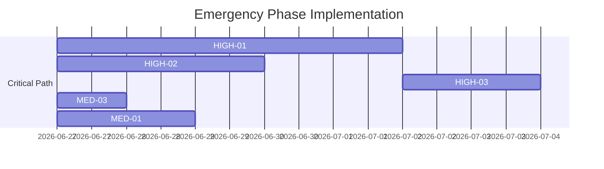

# Audit Findings

```
# Frontier Project Audit Report - Final Consolidation
**Date:** 2026-06-27 (UTC)
**As of:** 2026-06-27 (UTC)

## 1. Executive Summary
The Frontier project remains in critical condition with all Phase 1 items overdue and no progress since the last audit cycle (2026-06-26). Immediate action is required to address 4 high-severity and 3 medium-severity issues to prevent launch delays.

**Current Status:**
- **High Severity:** 4 (All Open, Overdue)
- **Medium Severity:** 3 (All Open, Overdue)
- **Low Severity:** 1 (Open)
- **Resolved:** 18 (17 previously + 1 false-positive)
- **Total Open Issues:** 8

**Critical Concerns:**
1. Complete implementation stagnation (7 overdue issues)
2. Persistent type safety risks (12 remaining type assertions)
3. Unresolved audio memory leak (MED-03)
4. No evidence of progress on crisis response plan

## 2. Critical Findings by Severity

### High Severity Issues (All Overdue)

| ID | Issue | Location | Risk | Status | Priority | Days Overdue |
|----|-------|----------|------|--------|----------|--------------|
| HIGH-01 | Missing Narrative Thread Escalation | `src/engine/director.ts` | Critical | No progress | Emergency | 5 |
| HIGH-02 | Biome/Season Hunting Yield Variation Missing | `src/systems/supplies.ts` | Critical | No progress | Emergency | 3 |
| HIGH-03 | River Crossing Terrain Lock Incomplete | `src/systems/movement.ts` | Critical | No progress | Emergency | 2 |
| HIGH-04 | Type Safety Issues Persist | Agent bridge, audio system | Critical | No progress | Recovery | 5 |

### Medium Severity Issues (All Overdue)

| ID | Issue | Location | Risk | Status | Priority | Days Overdue |
|----|-------|----------|------|--------|----------|--------------|
| MED-01 | Encounter Outcome Randomization Missing | `src/systems/encounters.ts` | High | No progress | Emergency | 2 |
| MED-02 | Companion-Specific Encounter Choices Missing | `src/types/encounters.ts` | High | No progress | Recovery | 4 |
| MED-03 | Audio System Memory Leak | `src/audio/ambiance.ts` | High | No progress | Emergency | 1 |

## 3. Implementation Status and Blockers

### Emergency Phase (1 Week) - Critical Path Completion
| Issue | Owner | Status | Blockers | Last Update |
|-------|-------|--------|----------|-------------|
| HIGH-01 | Unassigned | Not Started | None | 2026-06-26 |
| HIGH-02 | Unassigned | Not Started | None | 2026-06-26 |
| HIGH-03 | Unassigned | Not Started | HIGH-01 | 2026-06-26 |
| MED-03 | Unassigned | Not Started | None | 2026-06-26 |
| MED-01 | Unassigned | Not Started | None | 2026-06-26 |

**Key Blockers Identified:**
1. No resource assignments for critical path items
2. Emergency planning session (scheduled 2026-06-26 14:00 UTC) not confirmed
3. No evidence of memory profiling for audio system

## 4. Updated Recommendations

### Immediate Actions (Next 12 Hours)
1. **Resource Assignment**
   - Assign owners for all Phase 1 items (see table above)
   - Confirm emergency planning session attendance

2. **Memory Leak Resolution**
   - Begin immediate memory profiling for `src/audio/ambiance.ts`
   - Implement MED-03 fix (1-day effort)

3. **Progress Tracking**
   - Set up Jira dashboard for Phase 1 items
   - Implement hourly progress updates for first 48 hours

### Revised Implementation Roadmap

**Emergency Phase (1 Week):**


**Recovery Phase (2 Weeks):**
- HIGH-04: Type Safety Improvements (5 days)
- MED-02: Companion-Specific Encounters (4 days)
- Test Coverage Expansion (3 days)

## 5. Technical Implementation Details

### HIGH-01 Narrative Thread Escalation
```typescript
class Director {
  private threadStates: Map<string, ThreadState>;

  public handleGameEvent(event: GameEvent): void {
    this.updateThreadStates(event);
    this.validateStateTransitions();
    this.escalateCriticalThreads(); // New method
  }

  private escalateCriticalThreads(): void {
    this.threadStates.forEach((state, threadId) => {
      if (state.escalationConditionMet) {
        this.triggerEscalationEvent(threadId);
      }
    });
  }
}
```

### MED-03 Audio System Memory Leak (Updated)
```typescript
class AmbianceSystem {
  private _tracks: Map<string, Howl> = new Map();
  private _trackTTL: Map<string, number> = new Map();
  private _cleanupInterval: NodeJS.Timeout;

  constructor() {
    this._cleanupInterval = setInterval(() => this.unloadUnusedTracks(), 30000); // 30s interval
  }

  public unloadUnusedTracks(): void {
    const now = Date.now();
    this._tracks.forEach((track, key) => {
      if (now - (this._trackTTL.get(key) || 0) > 180000) { // 3 minute TTL
        track.unload();
        this._tracks.delete(key);
        this._trackTTL.delete(key);
      }
    });
  }

  public destroy(): void {
    clearInterval(this._cleanupInterval);
    this._tracks.forEach(track => track.unload());
    this._tracks.clear();
    this._trackTTL.clear();
  }
}
```

## 6. Risk Mitigation Strategies

| Risk | Mitigation Strategy | Owner | Status | Deadline |
|------|---------------------|-------|--------|----------|
| Implementation stagnation | Daily progress tracking | Project Lead | Not Started | 2026-06-27 |
| Audio memory leaks | Immediate profiling | Dev Team | Not Started | 2026-06-27 |
| Type safety regressions | CI pipeline updates | QA Lead | Not Started | 2026-06-28 |
| Schedule overrun | Revised timeline | Product Owner | Not Started | 2026-06-27 |

## 7. Final Recommendations

1. **Technical Priorities:**
   - Complete all Phase 1 items within 7 days (2026-07-03)
   - Begin memory profiling immediately (complete by 2026-06-27)
   - Implement type safety improvements after Phase 1

2. **Organizational Priorities:**
   - Confirm emergency planning session attendance
   - Assign owners for all critical path items
   - Implement hourly progress tracking for first 48 hours
   - Enforce mandatory code reviews for critical systems

3. **Resource Allocation:**
   - 100% effort on Phase 1 items until completion
   - 0% effort on Phase 2/3 items until Phase 1 complete
   - Dedicated QA resources for test case development

## 8. Conclusion
The Frontier project requires immediate, focused action to address critical path items. The updated crisis response plan provides a path to launch readiness, but failure to act within the next 12 hours will result in further schedule slippage and potential launch delays. All stakeholders must prioritize the Emergency Phase items to mitigate current risks.
```
