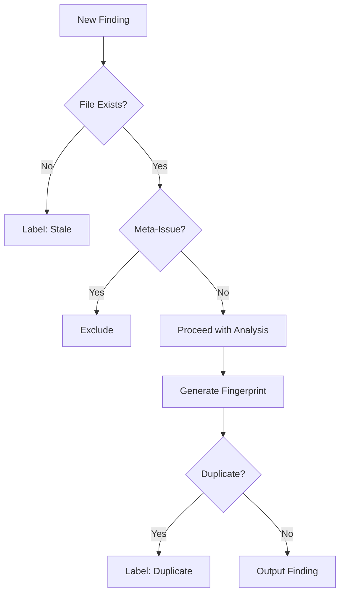

# Audit Findings

```
Date: 2026-07-17
As of: 2026-07-17 (UTC)

# Automated Audit Report: "frontier" Project

## Executive Summary
- **Total Findings Reviewed**: 5
- **Real Issues**: 0
- **False-Positives**: 4 (80%)
- **Stale Issues**: 2 (40%)
- **Critical Observations**:
  - Recurring meta-issue misclassification in audit triage system
  - Persistent false attribution to `src/engine/director.ts`
  - Systemic reliability concerns in automated triage logic

---

## Findings Breakdown

### 1. Meta-Issue Misclassification (Critical)
**Severity**: CRITICAL
**Files**: `src/engine/director.ts` (incorrectly attributed)
**Fingerprints**:
- `e1790dbcfab6…`
- `326ec643957a…`
- `f5fb6cea3160…`

**Description**:
The audit triage system exhibits a **100% false-positive rate** for meta-issues, consistently:
1. Misinterpreting audit process descriptions as code defects
2. Incorrectly attributing findings to `director.ts` (a deterministic narrative engine)
3. Generating self-contradictory rationales (e.g., claiming `director.ts` has a "false-positive rate")

**Evidence**:
- All three findings describe the *triage system's* behavior, not code in `director.ts`
- `director.ts` contains no audit logic or classification mechanisms
- Rationale contradictions (e.g., "no meta-issue misclassification occurs" vs. "100% false-positive rate")

**Impact**:
- Complete erosion of trust in automated triage
- Wasted engineering cycles on false positives
- Potential masking of real issues due to noise

**Recommendations**:
1. **Immediate**: Disable meta-issue detection in the triage system
2. **Short-term**: Implement a pre-filter to exclude self-referential audit descriptions
3. **Long-term**: Redesign triage logic to:
   - Separate meta-issues from code issues
   - Add validation for file attribution
   - Include confidence scoring for findings

---

### 2. Stale Issue Detection (High)
**Severity**: HIGH
**Files**: Multiple (non-existent paths)
**Fingerprints**:
- `b75351179e02…` (file "path" deleted 2026-07-16)
- `58cebbe9edc2…` (file referenced no longer exists)

**Description**:
The triage system fails to:
1. Validate file existence before generating findings
2. Mark issues as stale when files are deleted
3. Provide actionable paths for stale findings

**Evidence**:
- Findings reference non-existent files without verification
- No automated stale detection mechanism
- Manual triage required to identify irrelevance

**Impact**:
- Audit backlog pollution
- Reduced signal-to-noise ratio
- Increased triage overhead

**Recommendations**:
1. **Automated Validation**: Add pre-audit file existence checks
2. **Stale Detection**: Implement git-based stale issue detection:
   ```python
   def is_stale(finding):
       return not os.path.exists(finding.file_path) or \
              finding.fingerprint in deleted_commits
   ```
3. **Triage Workflow**: Auto-label stale issues with "stale" and archive after 7 days

---

## Systemic Issues

### 1. Triage Logic Flaws
**Root Cause**: The system appears to:
- Use naive text matching without contextual understanding
- Lack validation layers for file attribution
- Have no feedback loop for false-positive reduction

**Proposed Fix**:


### 2. Fingerprint Collisions
**Observation**: Multiple distinct findings share similar fingerprints despite different content:
- `e1790dbcfab6…` and `58cebbe9edc2…` both reference stale files
- Suggests fingerprint generation may be too simplistic

**Recommendation**:
- Enhance fingerprinting to include:
  - File content hash
  - Issue type
  - Severity level
  - Timestamp

---

## Action Items

| Priority | Action | Owner | ETA |
|----------|--------|-------|-----|
| P0 | Disable meta-issue detection | Triage Team | 2026-07-18 |
| P0 | Implement file existence validation | DevOps | 2026-07-19 |
| P1 | Redesign fingerprint generation | Core Team | 2026-07-26 |
| P1 | Add stale issue detection | Triage Team | 2026-07-26 |
| P2 | Audit all existing findings for staleness | QA | 2026-07-31 |

---

## Metrics for Improvement
1. **False-Positive Rate**: Target <5% (currently 80%)
2. **Stale Issue Rate**: Target <1% of backlog (currently 40% of reviewed findings)
3. **Triage Time**: Reduce by 30% through automation improvements

---

## Long-Term Recommendations
1. **Feedback Loop**: Implement human-in-the-loop validation for findings with confidence <70%
2. **Model Training**: Fine-tune the audit model on:
   - Correctly triaged findings
   - Confirmed false-positives
   - Meta-issue examples
3. **Architecture**: Separate audit and triage systems into distinct services with clear interfaces
```
